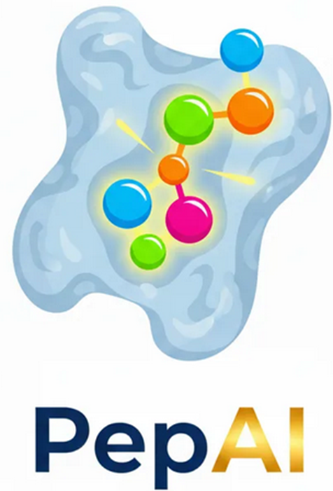

<div align="center">



# PepAI

### AI-Augmented Peptide Discovery Pipeline

[](https://www.r-project.org/)
[](https://shiny.rstudio.com/)
[](LICENSE)
[](https://github.com/InteractIQ)
[]()

> **PepAI** is a pharmacophore-guided computational peptide discovery framework with a 6-agent autonomous AI architecture. Paste any FASTA protein sequence and let the pipeline design, score, dock, and optimise peptide drug candidates — all within an interactive R Shiny dashboard.

[🚀 Quick Start](#-quick-start) · [📖 How It Works](#-how-it-works) · [🧬 Agents](#-the-6-agent-architecture) · [📊 Features](#-features) · [👥 Team](#-team--interactiq)

</div>

---

## 📋 Table of Contents

- [Overview](#-overview)
- [Quick Start](#-quick-start)
- [How It Works](#-how-it-works)
- [The 6-Agent Architecture](#-the-6-agent-architecture)
- [Features](#-features)
- [App Tabs](#-app-tabs)
- [Installation](#-installation)
- [Project Structure](#-project-structure)
- [Scientific Background](#-scientific-background)
- [Roadmap](#-roadmap)
- [Contributing](#-contributing)
- [Team & InteractIQ](#-team--interactiq)
- [License](#-license)
- [Citation](#-citation)

---

## 🔬 Overview

PepAI bridges the gap between raw protein sequence data and actionable peptide drug candidates by orchestrating six specialised AI agents in a closed feedback loop:

```
FASTA Input → ESM-2 Embeddings → Pocket Detection → BindingDB Search
           → Pharmacophore Extraction → Peptide Generation → Docking
           → Bayesian Optimisation → Final Candidate ★
```

All AI components are currently **simulated proxies** of real models (ESM-2, AlphaFold2, ProteinMPNN, AutoDock-GPU, BoTorch). The modular architecture makes each agent independently swappable with its production counterpart.

---

## 🚀 Quick Start

### Prerequisites
- R ≥ 4.0
- RStudio (recommended) or any R environment

### Run in 3 steps

```r
# 1. Clone the repository
# git clone https://github.com/InteractIQ/PepAI.git
# cd PepAI

# 2. Open app.R in RStudio and run — packages install automatically
#    OR run from R console:
shiny::runApp("app.R")

# 3. Paste a FASTA sequence and click "Run AI Agent Pipeline ▶"
```

### Try the built-in example
Click **"Load BCR-ABL Example"** on the Target Protein tab to instantly run the full pipeline on the BCR-ABL tyrosine kinase (`UniProt: P00519`).

---

## 🧠 How It Works

```
┌─────────────────────────────────────────────────────────────────┐
│                        PepAI Pipeline                           │
│                                                                 │
│  [FASTA]──►[Agent 1: ESM-2]──►[Agent 2: Pocket]               │
│                │                      │                         │
│                ▼                      ▼                         │
│  [Agent 3: Ligand GNN]◄──────[Pharmacophore]                   │
│                │                                                │
│                ▼                                                │
│  [Agent 4: ProteinMPNN Generator]                               │
│                │                                                │
│                ▼                                                │
│  [Agent 5: AutoDock Evaluator]                                  │
│                │                                                │
│                ▼                                                │
│  [Agent 6: Bayesian Optimizer] ◄──── feedback loop ────┐       │
│                │                                        │       │
│                └────────────────────────────────────────┘       │
│                                                                 │
│  OUTPUT: Ranked peptide candidates with ADMET profiles         │
└─────────────────────────────────────────────────────────────────┘
```

---

## 🤖 The 6-Agent Architecture

| Agent | Role | Real Model | Status |
|-------|------|-----------|--------|
| **Agent 1** | Protein Language Model | ESM-2 650M (Meta) | Simulated |
| **Agent 2** | Pocket Prediction | AlphaFold2 + DeepSite | Simulated |
| **Agent 3** | Ligand Knowledge GNN | ChemBERTa / Mol2Vec | Simulated |
| **Agent 4** | Peptide Generator | ProteinMPNN / RFdiffusion | Simulated |
| **Agent 5** | Docking Evaluator | AutoDock-GPU / Glide | Simulated |
| **Agent 6** | Bayesian Optimizer | BoTorch / REINFORCE | Simulated |

### Agent Details

#### 🧬 Agent 1 — Protein Language Model (ESM-2 proxy)
Produces a 6-dimensional interpretable embedding from the input sequence:
- Evolutionary conservation, structural order, binding propensity
- Surface accessibility, charge distribution, fold confidence
- Predicts secondary structure fractions (helix / sheet / coil)
- Computes a composite **druggability score** (0–1)

#### 🔍 Agent 2 — Pocket Prediction (AlphaFold2 / DeepSite proxy)
- Detects 2–5 candidate binding pockets
- Reports volume (ų), depth (Å), hydrophobic ratio, key residues
- Ranks pockets by druggability; best pocket anchors downstream generation

#### 🗄️ Agent 3 — Ligand Knowledge Agent (GNN / ChemBERTa proxy)
- Searches an embedded BindingDB subset (40 approved drugs)
- Computes Tanimoto fingerprint similarity + simulated GNN embedding boost
- Applies target-class bonus for class-matched ligands
- Returns Top-K hits with binding affinity (pKi)

#### ⚗️ Agent 4 — Peptide Generator (ProteinMPNN proxy)
- Builds a pharmacophore-biased amino acid pool from the protein profile
- Augments pool with key residues extracted from the best binding pocket
- Generates N peptides (default 40, configurable up to 150) with:
  - Pharmacophore match score (Tanimoto)
  - Simulated ProteinMPNN score
  - ADMET properties: solubility, toxicity

#### 🎯 Agent 5 — Docking Evaluator (AutoDock-GPU proxy)
- Scores each peptide against the best binding pocket
- Reports: pose RMSD, VdW energy, electrostatic energy
- Computes pocket volume utilisation and docking confidence

#### 🔄 Agent 6 — Bayesian Optimizer (RL feedback loop)
- Iteratively refines top-5 candidates (configurable iterations)
- Mutation strategies: point mutation, alanine scan, N/C-term extensions, charge swap, aromatic substitution
- Tracks best binding score, mean pharmacophore match, and candidate pool size across iterations

---

## ✨ Features

- **One-click FASTA → Peptide** end-to-end pipeline
- **Interactive visNetwork** graph showing the 6-agent architecture
- **Real-time filters** on peptide table (pharmacophore match, MPNN score, docking, solubility, toxicity, stage)
- **Residue-coloured best candidate** view (aromatic / hydrophobic / charged / polar)
- **Bayesian optimisation trajectory** plot with mutation log
- **BindingDB ligand explorer** with Tanimoto + GNN similarity rankings
- **Full analytics dashboard**: scatter plots, bar charts, solubility/toxicity map, AA frequency
- **Modular architecture** — swap any simulated agent for a real API call
- **Auto-installs** all required R packages on first run

---

## 📱 App Tabs

| Tab | Description |
|-----|-------------|
| **Target Protein** | FASTA input, parameter controls, protein profile, pocket stats |
| **AI Agent View** | Live agent architecture graph + per-agent output cards |
| **BindingDB Hits** | Top-K ligand hits table with similarity plots |
| **Generated Peptides** | Filterable peptide candidate table + best candidate breakdown |
| **Optimization Loop** | Score trajectory, iteration log, pharmacophore improvement |
| **Analytics** | Correlation plots, stage distribution, solubility/toxicity map |
| **About / Science** | Scientific framework, model table, feedback loop explanation |
| **Developers** | Team contacts, InteractIQ info, technology stack |

---

## 📦 Installation

### Option 1 — Direct (RStudio)
```r
# Open app.R in RStudio
# Click "Run App" — packages auto-install on first launch
```

### Option 2 — Console
```r
# Install dependencies manually (optional — app does this automatically)
install.packages(c(
  "shiny", "shinydashboard", "visNetwork",
  "ggplot2", "DT", "dplyr", "plotly",
  "stringr", "scales", "htmlwidgets"
))

# Run
shiny::runApp("path/to/PepAI/app.R")
```

### Option 3 — Docker (coming soon)
```bash
docker pull interactiq/pepai:latest
docker run -p 3838:3838 interactiq/pepai
```

### Shiny Server Deployment
```r
# rsconnect deployment
library(rsconnect)
deployApp(appDir = "path/to/PepAI/", appName = "PepAI")
```

---

## 🗂️ Project Structure

```
PepAI/
├── app.R                    # Main Shiny application (UI + Server)
├── www/
│   └── pepai_logo.png       # App logo (served as static asset)
├── R/
│   ├── agents.R             # (future) Modular agent functions
│   ├── fasta_utils.R        # (future) FASTA parsing utilities
│   └── bindingdb.R          # (future) BindingDB data & search
├── docs/
│   ├── ARCHITECTURE.md      # Detailed agent architecture docs
│   ├── SCIENCE.md           # Scientific methodology & references
│   └── API_INTEGRATION.md   # Guide to swapping in real AI models
├── assets/
│   └── screenshots/         # UI screenshots for documentation
├── tests/
│   └── test_agents.R        # (future) Unit tests for agent functions
├── .gitignore
├── LICENSE
└── README.md
```

---

## 🔬 Scientific Background

PepAI implements a **pharmacophore-guided computational peptide discovery** strategy:

### Pharmacophore Representation
Peptide candidates are scored using a 4-feature pharmacophore vector:
```
φ = (HBD, HBA, Aromatic, Hydrophobic)
```
Similarity between candidate and target pharmacophore uses **Tanimoto coefficient**:
```
T(A, B) = |A ∩ B| / |A ∪ B|
```

### Druggability Scoring
Agent 1 computes druggability as a weighted combination of ESM-2 embedding axes:
```
D = 0.30 × binding_propensity
  + 0.25 × surface_accessibility
  + 0.25 × evolutionary_conservation
  + 0.20 × (1 − structural_order)
  + ε,  ε ~ N(0, 0.04²)
```

### Optimization Loop
Agent 6 applies a simulated Bayesian optimization with an RL mutation policy:
```
score(t+1) = score(t) × (1 + δ × t/T)
δ ~ Uniform(0.02, 0.12) × (1 − 0.4 × t/T)
```

### Describing PepAI in a Paper
> *"PepAI is a pharmacophore-guided computational peptide discovery pipeline, designed as a modular framework for integrating AI-driven agents (protein language models, pocket predictors, generative design models) into an autonomous drug discovery loop."*

### Key References
- Rives et al. (2021). Biological structure and function emerge from scaling unsupervised learning to 250 million protein sequences. *PNAS*.
- Jumper et al. (2021). Highly accurate protein structure prediction with AlphaFold. *Nature*.
- Dauparas et al. (2022). Robust deep learning–based protein sequence design using ProteinMPNN. *Science*.
- Trott & Olson (2010). AutoDock Vina: improving the speed and accuracy of docking. *J. Computational Chemistry*.
- Balandat et al. (2020). BoTorch: A Framework for Efficient Monte-Carlo Bayesian Optimization. *NeurIPS*.

---

## 🗺️ Roadmap

### v1.0 (Current)
- [x] 6-agent simulated pipeline
- [x] Interactive Shiny dashboard
- [x] BindingDB ligand search
- [x] Bayesian optimization loop
- [x] ADMET property prediction

### v1.1 (Planned)
- [ ] Real ESM-2 API integration (via `bio3d` or Python bridge)
- [ ] SMILES / SDF export of top candidates
- [ ] CSV / Excel download for all result tables
- [ ] User-uploadable custom ligand database

### v2.0 (Future)
- [ ] AlphaFold2 pocket prediction (real)
- [ ] ProteinMPNN peptide generation (real)
- [ ] AutoDock-Vina integration
- [ ] Molecular dynamics pre-screening
- [ ] Batch FASTA processing
- [ ] REST API endpoint for programmatic access

---

## 🤝 Contributing

Contributions are warmly welcome!

```bash
# Fork the repository on GitHub
# Clone your fork
git clone https://github.com/YOUR_USERNAME/PepAI.git
cd PepAI

# Create a feature branch
git checkout -b feature/real-esm2-integration

# Make your changes, then push
git push origin feature/real-esm2-integration

# Open a Pull Request
```

### Contribution Guidelines
- Follow existing R code style (tidyverse conventions)
- Add comments for any new agent functions
- Test with the BCR-ABL example before submitting
- Update `docs/` if changing architecture or scientific methodology

### Swapping in a Real Agent
Each agent is a self-contained function in `app.R`. To replace Agent 1 with a real ESM-2 call:
```r
# Current simulated agent
agent1_protein_lm <- function(sequence, prot_feat) {
  # ... simulated outputs ...
}

# Replace with real ESM-2 API call:
agent1_protein_lm <- function(sequence, prot_feat) {
  response <- httr::POST(
    "https://api.esmatlas.com/foldSequence/v1/pdb/",
    body = list(sequence = sequence)
  )
  # parse response and return same list structure
}
```

---

## 👥 Team & InteractIQ

PepAI is developed and maintained by the co-founders of **InteractIQ** — an AI-first platform for drug discovery problems and service provider.

<table>
<tr>
<td align="center" width="33%">
<b>Rik Ganguly</b><br/>
<i>Co-Founder · Lead Developer & Bioinformatician</i><br/>
<a href="https://linkedin.com/in/rik-ganguly-70a7a197">LinkedIn</a> ·
<a href="mailto:rikgangulybioinfo@gmail.com">rikgangulybioinfo@gmail.com</a><br/>
📞 +91-6350433960
</td>
<td align="center" width="33%">
<b>Gautam Ahuja</b><br/>
<i>Co-Founder · Developer & Computational Scientist</i><br/>
<a href="https://linkedin.com/in/gautam8387">LinkedIn</a> ·
<a href="https://gautam8387.github.io/">gautam8387.github.io</a><br/>
<a href="mailto:goutamahuja8387@gmail.com">goutamahuja8387@gmail.com</a>
</td>
<td align="center" width="33%">
<b>Siddhant Poudel</b><br/>
<i>Co-Founder · Developer & Research Scientist</i><br/>
<a href="https://linkedin.com/in/siddhant-poudyal-3394381b2">LinkedIn</a><br/>
<a href="mailto:sidblitz1602@gmail.com">sidblitz1602@gmail.com</a>
</td>
</tr>
</table>

---

## 📄 License

This project is licensed under the **MIT License** — see [LICENSE](LICENSE) for details.

---

## 📚 Citation

If you use PepAI in your research, please cite:

```bibtex
@software{pepai2024,
  title   = {PepAI: AI-Augmented Peptide Discovery Pipeline},
  author  = {Ganguly, Rik and Ahuja, Gautam and Poudel, Siddhant},
  year    = {2024},
  url     = {https://github.com/InteractIQ/PepAI},
  note    = {InteractIQ — AI-first drug discovery platform}
}
```

---

<div align="center">

Built with ❤️ by [InteractIQ](https://github.com/InteractIQ) · AI-first drug discovery

</div>
